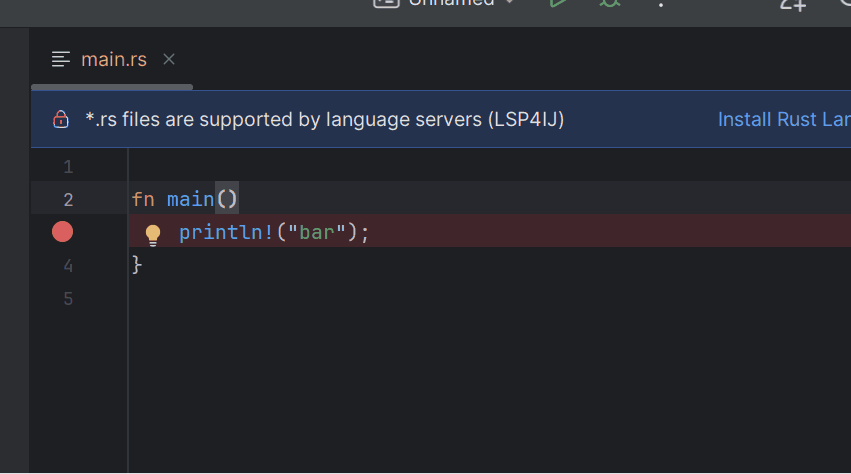
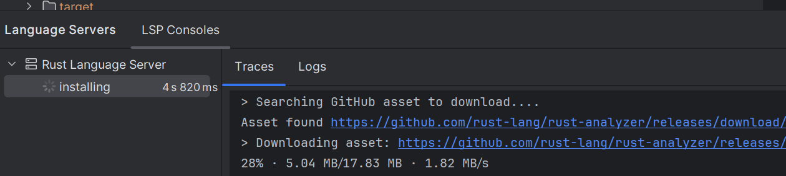
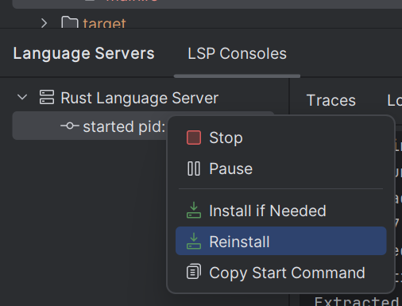
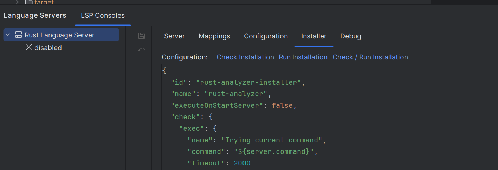

LSP4IJ provides free DAP and LSP support for JetBrains IDE. DAP and LSP servers can be registered via an extension point so they can be integrated into an IntelliJ plugin.

But if you don't have the skills to do this, LSP4IJ allows you to register your LSP/DAP servers using the LSP/DAP server creation dialogs. The server description is stored in several JSON files that allow you to export/import the server into a template and easily share it with your team. This is called a user-defined server.

This feature has existed since the beginning of the LSP4IJ project, but one of the points that hadn't been addressed was server installation, which can be tedious. LSP4IJ 0.14.0 now provides the ability to automatically install an LSP/DAP server, allowing you to benefit from a language server with a single click.

Here is a demo with Rust:



The same thing exists for DAP servers.

Here is a demo with VSCode JS Debug:


# What does it mean to install an LSP/DAP server?

Installing an LSP/DAP server generally requires the following steps:

* Checking and installing a runtime (Java, Node, Go, etc.) or not. To check for instance if node is installed. You can 
execute the following command on Windows OS:

```
where node
```

and the following command on other OS

```
which node
```

If the server is an executable, this step is not required.
* Downloading the server using tools like npm or via a given URL. Some servers are downloadable via the GitHub releases page or Maven Central.
* Extracting the downloaded file if it's a zip, tar, etc.
* Granting execute permissions to the extracted server file
* Updating the server startup command to reference the downloaded server file

All those steps are boring and adjusting command can takes some times.

# LSP/DAP server installer

## UI server installer

 * Installer is executed when language server is started



 * Installer can be replayed:
 


 * Installer can be declarative and you can update the declaration and run it


   
## Server installer API

LSP4PIJ provide an API to [install LSP server](https://github.com/redhat-developer/lsp4ij/blob/main/docs/LSPApi.md#language-server-installer)
and DAP server which are executed when server is started. Here a sample to install a language server:

```java
package my.language.server;

import com.intellij.openapi.progress.ProgressIndicator;
import com.intellij.openapi.progress.ProgressManager;
import com.redhat.devtools.lsp4ij.installation.LanguageServerInstallerBase;
import org.jetbrains.annotations.NotNull;

/**
 * A custom implementation of the {@link LanguageServerInstallerBase} class for installing a language server.
 * <p>
 * This class provides the logic to check if the language server is installed and performs the actual installation process
 * in steps, updating the progress indicator accordingly.
 */
public class MyLanguageServerInstaller extends LanguageServerInstallerBase {

    /**
     * Checks if the language server is installed.
     * <p>
     * This implementation returns {@code true} to indicate the server is installed, but you should modify it to check
     * the actual installation state of your language server.
     * 
     * @return true if the server is installed, false otherwise.
     */
    @Override
    protected boolean checkServerInstalled(@NotNull ProgressIndicator indicator) {
        // check here if your language server is correctly installed
        progress("Checking if the language server is installed...", indicator);
        // Check if user has canceled the server installer task
        ProgressManager.checkCanceled();
        return true;
    }

    /**
     * Installs the language server in steps, updating the progress indicator during the process.
     * <p>
     * This implementation provides two installation steps. You can modify this method to match the actual installation
     * steps for your language server.
     * 
     * @param indicator the {@link ProgressIndicator} to update the installation progress.
     * @throws Exception if an error occurs during the installation process.
     */
    @Override
    protected void install(@NotNull ProgressIndicator indicator) throws Exception {
        // process installation of step 1: downloading server components
        progress("Downloading server components...", 0.25, indicator);
        // Check if user has canceled the server installer task
        ProgressManager.checkCanceled();

        // process installation of step 2: configuring server
        progress("Configuring server...", 0.5, indicator);
        // Check if user has canceled the server installer task
        ProgressManager.checkCanceled();
        
        // process installation of step 3: finalizing installation
        progress("Finalizing installation...", 0.75, indicator);
        // Check if user has canceled the server installer task
        ProgressManager.checkCanceled();
        
        // process installation of step 4: installation complete
        progress("Installation complete!", 1.0, indicator);
        // Check if user has canceled the server installer task
        ProgressManager.checkCanceled();
    }
}
```

## Declarative Server installer

This previous installer is implemented with Java code and can be used when language server is integrated inside an InteliJ plugin.

The rust demo which create the rust-analyzer language server and install it is fully declarative and are described
with several JSON files in [templates/lsp/rust-analyzer](https://github.com/redhat-developer/lsp4ij/tree/main/src/main/resources/templates/lsp/rust-analyzer)
The challenge here was to provide a declarative installer (by using JSON) like [templates/lsp/rust-analyzer/installer.json](https://github.com/redhat-developer/lsp4ij/blob/main/src/main/resources/templates/lsp/rust-analyzer/installer.json)
to provide the capability to have a full declarative definition of LSP/DAP server to provide a catalog kind of served:

* [/templates/lsp](https://github.com/redhat-developer/lsp4ij/tree/main/src/main/resources/templates/lsp) stores several LSP servers.
* [/templates/dap](https://github.com/redhat-developer/lsp4ij/tree/main/src/main/resources/templates/dap) stores several DAP servers.

## Writing an LSP template

Let's study the rust-analyzer JSON files.

### template.json

The [template.json]([templates/lsp/rust-analyzer](https://github.com/redhat-developer/lsp4ij/tree/main/src/main/resources/templates/lsp/rust-analyzer/template.json) defines the language server: the name, the start command and the file mappings:

```json
{
  "id": "rust-analyzer",
  "name": "Rust Language Server",
  "programArgs": {
    "default": "sh -c ${BASE_DIR}/rust-analyzer",
    "windows": "${BASE_DIR}/rust-analyzer.exe"
  },
  "expandConfiguration": true,
  "fileTypeMappings": [
    {
      "fileType": {
        "name": "Rust",
        "patterns": [
          "*.rs"
        ]
      },
      "languageId": "rust"
    },
    {
      "fileType": {
        "name": "ra_syntax_tree",
        "patterns": [
          "*.rast"
        ]
      },
      "languageId": "ra_syntax_tree"
    }
  ]
}
```

### settings.json

The [settings.json]([templates/lsp/rust-analyzer](https://github.com/redhat-developer/lsp4ij/tree/main/src/main/resources/templates/lsp/rust-analyzer/settings.json)
defines the default configuration expected by the language server.

```json
{
  ...,
  "rust-analyzer.lens.references.adt.enable": false,
  "rust-analyzer.lens.references.enumVariant.enable": false,
  "rust-analyzer.lens.references.method.enable": true,
  "rust-analyzer.lens.references.trait.enable": false,
  "rust-analyzer.lens.run.enable": true,
  ...
}
```

### settings.schema.json

The [settings.schema.json]([templates/lsp/rust-analyzer](https://github.com/redhat-developer/lsp4ij/tree/main/src/main/resources/templates/lsp/rust-analyzer/settings.schema.json)
defines teh JSOn Schema of teh settings.

```json
...
  "rust-analyzer.lens.references.adt.enable": {
    "default": false,
    "type": "boolean",
    "description": "Whether to show `References` lens for Struct, Enum, and Union.\nOnly applies when `#rust-analyzer.lens.enable#` is set."
  },
  "rust-analyzer.lens.references.enumVariant.enable": {
    "default": false,
    "type": "boolean",
    "description": "Whether to show `References` lens for Enum Variants.\nOnly applies when `#rust-analyzer.lens.enable#` is set."
  },
  "rust-analyzer.lens.references.method.enable": {
    "default": false,
    "type": "boolean",
    "description": "Whether to show `Method References` lens. Only applies when\n`#rust-analyzer.lens.enable#` is set."
  },
  "rust-analyzer.lens.references.trait.enable": {
    "default": false,
    "type": "boolean",
    "description": "Whether to show `References` lens for Trait.\nOnly applies when `#rust-analyzer.lens.enable#` is set."
  },
  "rust-analyzer.lens.run.enable": {
    "default": true,
    "type": "boolean",
    "description": "Whether to show `Run` lens. Only applies when\n`#rust-analyzer.lens.enable#` is set."
  }

...
```

### installer.json

```json
{
  "id": "rust-analyzer-installer",
  "name": "rust-analyzer",
  "executeOnStartServer": false,
  "check": {
    "exec": {
      "name": "Trying current command",
      "command": "${server.command}",
      "timeout": 2000
    }
  },
  "run": {
    "download": {
      "name": "Download rust-analyzer",
      "github": {
        "owner": "rust-lang",
        "repository": "rust-analyzer",
        "prerelease": false,
        "asset": {
          "windows": {
            "x86_64": "rust-analyzer-x86_64-pc-windows-msvc.zip",
            "x86": "rust-analyzer-i686-pc-windows-msvc.zip",
            "arm64": "rust-analyzer-aarch64-pc-windows-msvc.zip"
          },
          "unix": {
            "x86_64": "rust-analyzer-x86_64-unknown-linux-gnu.gz",
            "arm64": "rust-analyzer-aarch64-unknown-linux-gnu.gz"
          },
          "mac": {
            "x86_64": "rust-analyzer-x86_64-apple-darwin.gz",
            "arm64": "rust-analyzer-aarch64-apple-darwin.gz"
          }
        }
      },
      "url": {
        "windows": {
          "x86_64": "https://github.com/rust-lang/rust-analyzer/releases/download/2025-05-12/rust-analyzer-x86_64-pc-windows-msvc.zip",
          "x86": "https://github.com/rust-lang/rust-analyzer/releases/download/2025-05-12/rust-analyzer-i686-pc-windows-msvc.zip",
          "arm64": "https://github.com/rust-lang/rust-analyzer/releases/download/2025-05-12/rust-analyzer-aarch64-pc-windows-msvc.zip"
        },
        "unix": {
          "x86_64": "https://github.com/rust-lang/rust-analyzer/releases/download/2025-05-12/rust-analyzer-x86_64-unknown-linux-gnu.gz",
          "arm64": "https://github.com/rust-lang/rust-analyzer/releases/download/2025-05-12/rust-analyzer-aarch64-unknown-linux-gnu.gz"
        },
        "mac": {
          "x86_64": "https://github.com/rust-lang/rust-analyzer/releases/download/2025-05-12/rust-analyzer-x86_64-apple-darwin.gz",
          "arm64": "https://github.com/rust-lang/rust-analyzer/releases/download/2025-05-12/rust-analyzer-aarch64-apple-darwin.gz"
        }
      },
      "output": {
        "dir": "$USER_HOME$/.lsp4ij/lsp/rust-analyzer",
        "file": {
          "name": {
            "windows": "rust-analyzer.exe",
            "unix": {
              "x86_64": "rust-analyzer-x86_64-unknown-linux-gnu",
              "arm64": "rust-analyzer-aarch64-unknown-linux-gnu"
            },
            "mac": {
              "x86_64": "rust-analyzer-x86_64-apple-darwin",
              "arm64": "rust-analyzer-aarch64-apple-darwin"
            }
          },
          "executable": true
        }
      },
      "onSuccess": {
        "configureServer": {
          "name": "Configure Rust Language server command",
          "command": "${output.dir}/${output.file.name}",
          "update": true
        }
      }
    }
  }
}
```

TODO: explain tis descrpitor

# Conclusion

Read https://github.com/redhat-developer/lsp4ij/blob/main/docs/UserDefinedLanguageServerTemplate.md